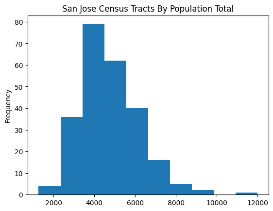
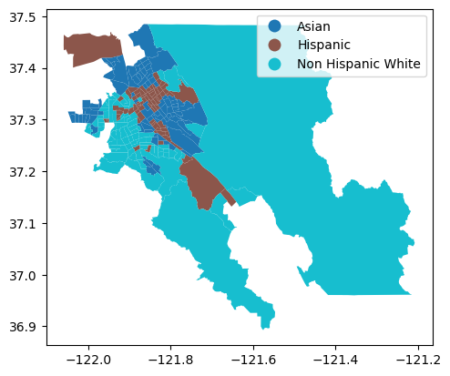
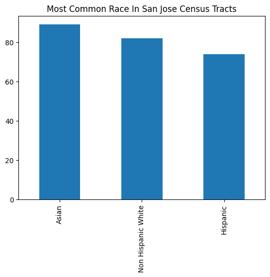
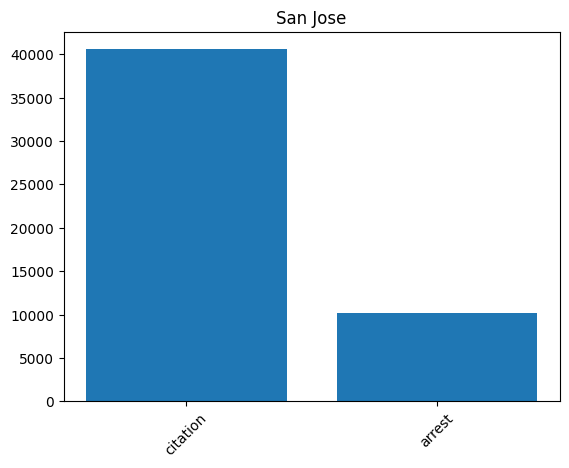
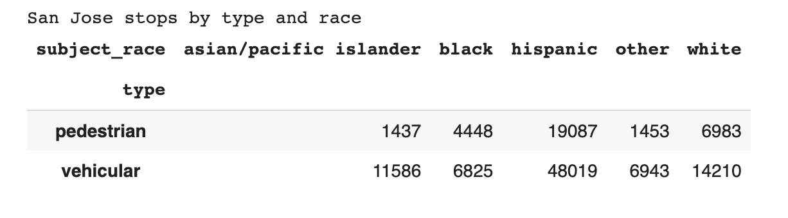
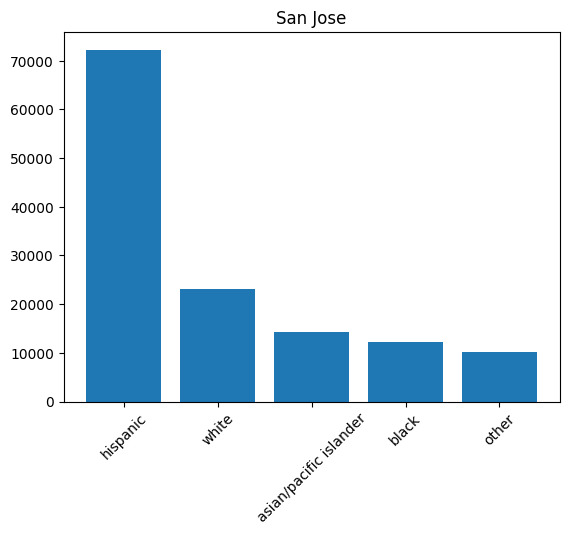

# Question: Does being "Race out of Place" in San Jose lead to a more severe outcome at a police stop? 

## Project Goals
In this project, we aim to investigate a phenomenon known as "Race out of Place". It is well known that some racial groups experience more frequent and more severe outcomes in police interactions. We hypothesize that when people are in an area where they are not the majority race -- they are 'out of place' -- they will experience more severe outcomes (for instance, they are more likely to be arrested). Policing in the context of race is an extremely important question because of well known disparities between racial groups in police interactions. But, if police tend to more harshly police groups in areas where they are not the majority race, this signals that police may not only take into account the race of their suspect, but also the racial context around their suspect, an important distinction in understand the implicit biases of policing.

## Description of Data
Our data is drawn from two sources: U.S. census data and San Jose Police Data from the Stanford Open Policing Project.

### Census Data
Census data is divided into tracts, geographical areas with around 2,000 - 10,000 people each in San Jose

The tracts are racially diverse, being fairly evenly split between plurality asian, white, and hispanic

### Policing Data
Most stops tend to end with citations, but a significant portion end with a much more sever outcome: arrest.

Most stops tend to be vehicular.

There are clear racial disparities in policing based on race. This graph shows the total number of police interactions, based on the race of the suspect. Clearly, hispanics interact with the police a disportionate amount

## Modelling

## Conclusion
San Jose is a major metropolitan area encompassing 1 million people, but it is also a unique geoeconomic zone, supported by commuters from the South Bay Area and San Francisco as well as housing commuters to the greater Bay Area locations. It also does not reflect the demographics of major cities outside California, like, say Detroit, NYC, or Chicago, which have more Black and Hispanic majority census tracts.

We found very different results of our investigation depending on the race of the subject being stopped. For example, with Black subjects, the likelihood of their stop resulting in an arrest is highest in majority white census tracts, while majority Hispanic and Asian census tracts actually have a minorly mitigating effect, with our model predicting it slightly more likely that a stop of a Black subject there would be a citation, not an arrest. All these variables have relatively very small effects on the overall probability of an arrest, but that is likely due to a limitation of the model and our data. Furthermore, an issue with using San Jose only in this model is that there are no majority Black census tracts in the city to properly test every aspect of the race out of place theory.

For Asian subjects, the census tracts in which they are most likely to be arrested are actually flipped. There is also a noticeably larger effect that the majority race of the census tract has on the overall probability or likelihood that a stop will result in an arrest for an Asian subject. Where the coefficient on the majority white census tracts for Black subjects was (0.015702), it is (-0.027291) for Asian subjects, an increase in importance of nearly double. Furthermore, the experience of Race out of Place is complicated for Asian subjects -- they actually experience a higher likelihood of being arrested in majority Asian census tracts, as well as in majority Hispanic tracts. This could possibly be explained by discrimination amongst sub-Asian ethnicities that is not captured by the census tract or police profiling data, which both only go down to a granularity of Asian. However, an Indian person in a South Korean majority neighborhood would visibly be race out of place, despite the data coding both ethnicities as Asian.

Hispanic subjects in San Jose experience a slightly higher likelihood of being arrested only in majority Asian census tracts, having decreased likelihoods when they are race in place, or in majority white census tracts. However, like with Black subjects, the coefficients on all census tract racial variables are very small, with the coefficient on a majority Asian census tract being the highest at (0.012869). This implies that the dominant race of the surroundings is less of an issue for Hispanic subjects to traffic stops, but could also be a result of confounding factors. After all, both white Hispanics and Afro-Latinos are put in the Hispanic category, and could still be race in place while in majority white tracts. There are overall fewer Asian Hispanics in the US, making up only 6% of the entire US Hispanic population, and so the likelihood of an Asian Hispanic in this dataset being stopped in an Asian neighborhood as race in place is lower than a White Hispanic stopped in a white neighborhood.

Finally, for Non-Hispanic Whites, they too only experience a higher likelihood of being arrested in majority Asian census tracts. In majority white or Hispanic tracts, they are less likely to be arrested rather than cited.

